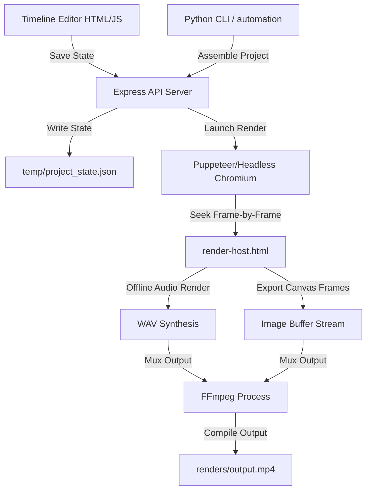

# HtmlVR

A lightweight, programmatically controllable HTML5 video sequencer, timeline editor, and headless rendering pipeline. It bridges the gap between browser-based interactive editing and automated AI-directed media production.

## Features
- **Reaper-style DAW Architecture:** Supports universal tracks (HTML slide templates, MP4/WebM videos, PNG/JPG images, MP3/WAV narration voiceovers, and background music).
- **Interactive Web UI:** Sleek dark-mode editor with dragging, resizing, live volume meters, visual compressor threshold controls, and real-time transform tweaks (scale, offset, rotation, opacity, transitions).
- **Headless Offline Renderer:** A Puppeteer-driven Chromium instance seeks frame-by-frame, captures frame buffers, synthesizes offline Web Audio buffers into standard WAV files, and muxes everything into high-definition MP4 videos via FFmpeg.
- **Embedded Subprojects:** Nest projects inside tracks of other projects (like nested timelines/sequences in DaVinci Resolve) with automatic duration syncing and audio mixing.
- **AI-Agent Friendly:** Timeline state represented in clean JSON schemas optimized for AI workspace integration. Includes Python automation triggers and voiceover TTS scripts.

---

## Architecture Diagram



---

## Directory Structure
```
├── server.js                 # Express server with Puppeteer/FFmpeg render pipeline
├── package.json              # Node dependencies (express, puppeteer)
├── monitor_trigger.py        # Background watcher for AI-agent workflow triggers
├── generate_voice.py         # TTS voiceover generator script
├── inpaint_service.py        # Clean background inpainting service (OpenCV/IOPaint)
├── split_composition.py      # Utility to split HTML assets
├── watermark_cleaner.py      # Watermark/noise removal utility
├── gemini.md                 # System Guide for Agent interactions
├── temp/                     # Workspace state caches & temporary file output
├── renders/                  # Output directory for compiled MP4 videos
└── public/                   # Static browser assets
    ├── editor.html           # Dark-mode Editor timeline page
    ├── editor.js             # Drag-and-drop timeline, compression bounds logic
    ├── render-host.html      # Sandbox viewport for headless recording & Web Audio mix
    ├── compositions/         # HTML visual slide & particle compositions
    └── js/                   # Core audio-visualizer, api client, and timeline scripts
```

---

## Prerequisites
To run HtmlVR locally, ensure you have the following installed:
1. **Node.js** (v18+)
2. **Python 3.8+**
3. **FFmpeg** (installed and added to your system `PATH`)

---

## Getting Started

### 1. Installation
Clone the repository and install the Node dependencies:
```bash
npm install
```

Install the optional Python dependencies for automation (voiceover generation & image inpainting):
```bash
pip install requests python-dotenv numpy opencv-python iopaint
```

### 2. Running the Editor
Start the Express server:
```bash
npm run dev
```
The editor will be available at `http://localhost:3333/editor.html`.

### 3. CLI Automation & Rendering
Run the background trigger monitor to let automation scripts react to UI actions:
```bash
python monitor_trigger.py
```

---

## Third-Party Libraries & Licenses

HtmlVR stands on the shoulders of several excellent open-source libraries and utilities:

### 1. Backend Dependencies (Node.js & Python)
* **Express** ([MIT License](https://github.com/expressjs/express/blob/master/LICENSE)) - Minimalist web framework for Node.js.
* **Puppeteer** ([Apache 2.0 License](https://github.com/puppeteer/puppeteer/blob/main/LICENSE)) - Headless Chromium API control.
* **adm-zip** ([MIT License](https://github.com/cthackers/adm-zip/blob/master/LICENSE)) - In-memory ZIP read/write utility.
* **python-dotenv** ([BSD 3-Clause License](https://github.com/theofanis/python-dotenv/blob/master/LICENSE)) - Loads environment variables from `.env` in Python scripts.
* **Requests** ([Apache 2.0 License](https://github.com/psf/requests/blob/main/LICENSE)) - Python HTTP library for API communication.
* **OpenCV (opencv-python)** ([Apache 2.0 License](https://github.com/opencv/opencv/blob/4.x/LICENSE)) - Python computer vision library.
* **IOPaint** ([MIT License](https://github.com/Sanster/IOPaint/blob/main/LICENSE)) - AI-powered image inpainting library.

### 2. Frontend Libraries
* **webm-muxer** ([MIT License](https://github.com/thenickdude/webm-muxer/blob/main/LICENSE)) - JavaScript library to package video frames into WebM format.

### 3. External Executables
* **FFmpeg** ([LGPL / GPL Licenses](https://ffmpeg.org/legal.html)) - Spawned locally for audio conversions and video/audio muxing. *(Note: Not bundled with this codebase. Must be pre-installed on the system).*

---

## Project License
This project is licensed under the **MIT License**. See the `LICENSE` file for details.
